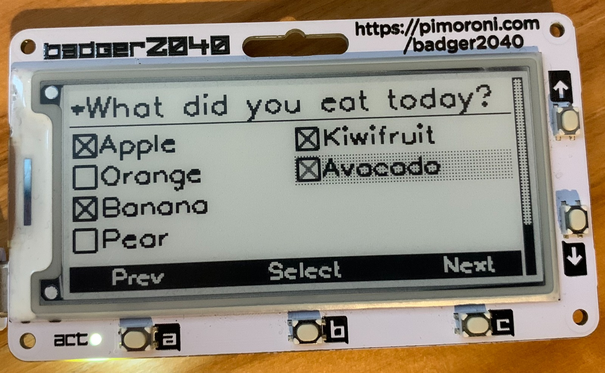
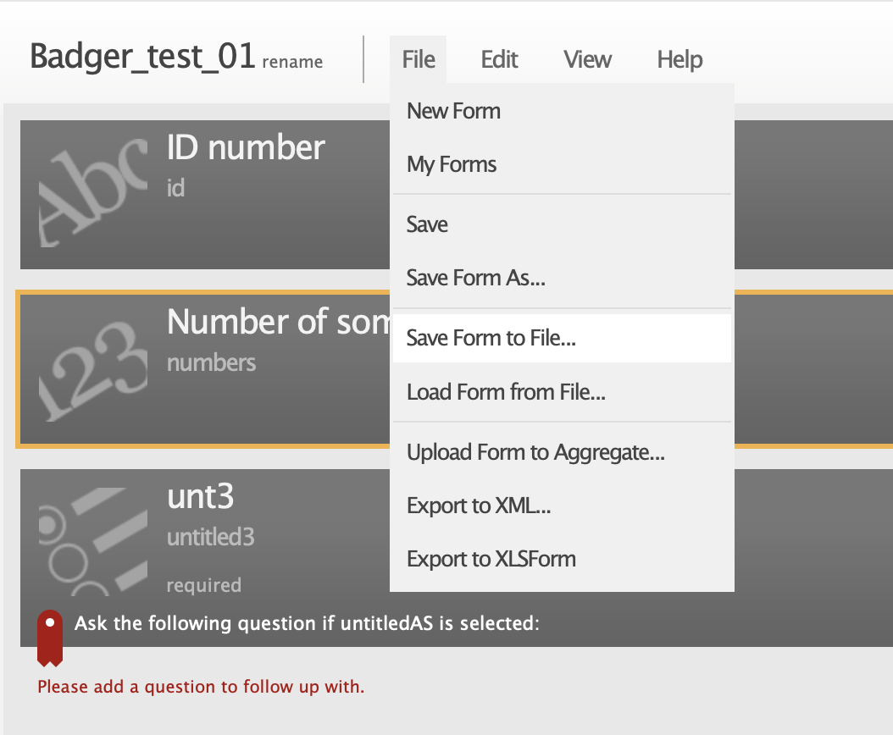
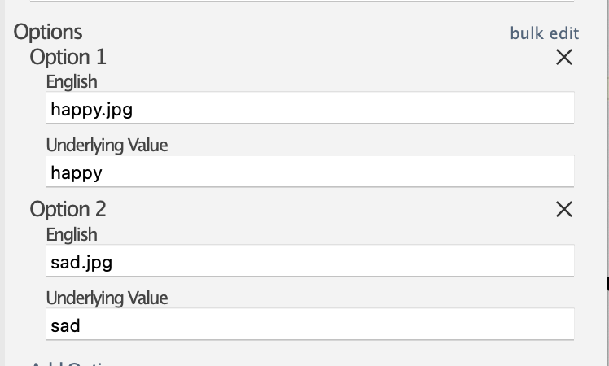
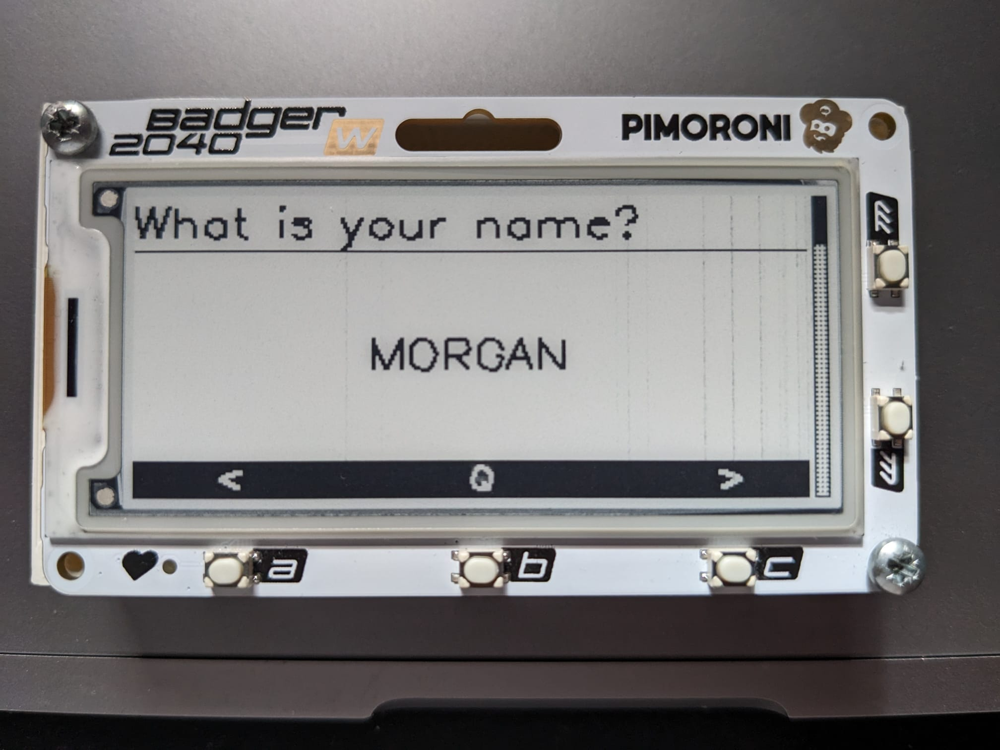
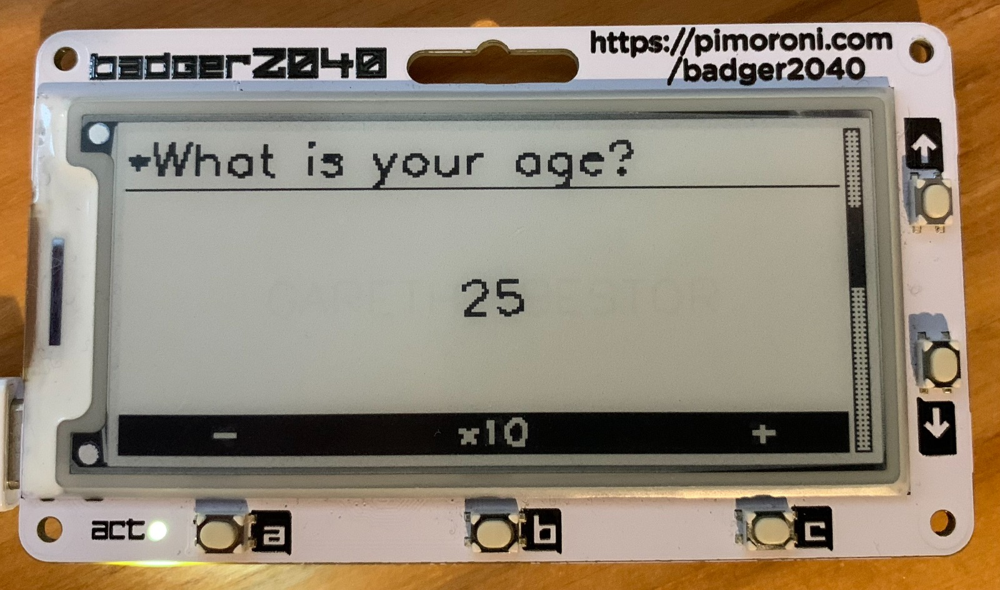
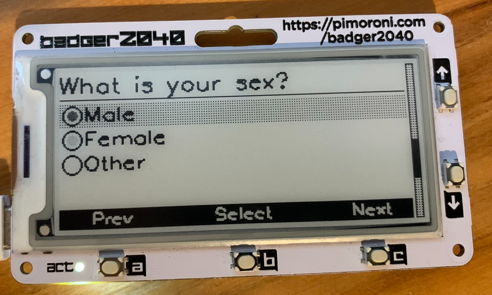
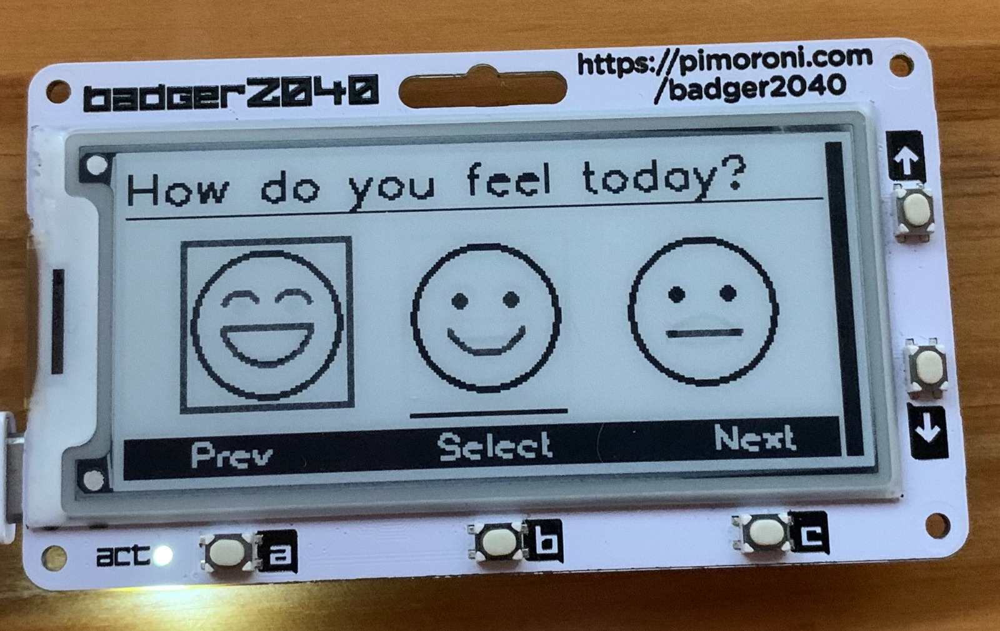
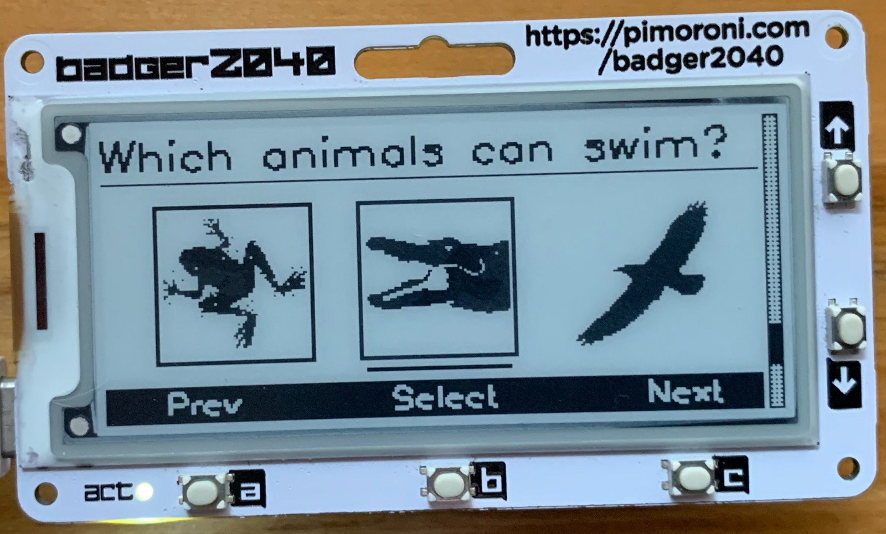

# Badger2040_XForm
An XForm interface for Badger2040

  

The Badger 2040 is a wearable device with an e-ink display which comes in two flavours, either with or without WiFi. 

The device has potential as a data collection system, especially in the context of data journaling of events or observations taking place across long periods of time.
The device benefits from extremely low power draw, meaning that it can potentially be used in low resource settings where there is a lack of access to options for charging smart devices, and/or low device literacy. 

This project aims to develop a framework for data collection using the Badger2040, using ODK's XLSForm architecture as the archetype. 

Various aspects of the XLSForm are outside the scope of the device's limited computational capabilities, so we focus here on core survey functions.

# Requirements

### Minimal 

* Badger2040 or Badger2040w
  * https://shop.pimoroni.com/products/badger-2040?variant=39752959852627  
  * https://shop.pimoroni.com/products/badger-2040-w?variant=40514062188627
* Thonny (or another compatible IDE)
  * https://thonny.org/

### Full
* ODK Central
  

# XLSForm compatibility

## Supported question types

|Question type| Supported   |Detail|
|-------------|-------------|------------------------------------|
|text         |	     Yes    |Free text response.
|integer	    |      Yes    |Integer (i.e., whole number) input|X|
|select_one* [options]	| Yes |Multiple choice question; only one answer can be selected.
|select_multiple* [options]	| Yes |	Multiple choice question; multiple answers can be selected.

*Both select_one and select_many type questions allow the use of image files instead of text

## Question types on the wishlist

|Question type| Supported   |Detail                              |Use Case|Barriers|
|-------------|-------------|------------------------------------|--------|--------|
|decimal      |	     No     |Decimal input |
|range        |      No	    |Range input (including rating)
|date	| No |	Date input
|time	| No |	Time input
|note		| No |Display a note on the screen, takes no input. Shorthand for type=text with readonly=true
|rank [options]	| No |	Rank question; order a list
|geopoint		| No |Collect a single GPS coordinate
|geotrace		| No |Record a line of two or more GPS coordinates
|dateTime	| No |	Accepts a date and a time input
|calculate	| No |	Perform a calculation; see the Calculation section below
|file	| No |	Generic file input (txt, pdf, xls, xlsx, doc, docx, rtf, zip)
|acknowledge	| No |	Acknowledge prompt that sets value to "OK" if selected

## Question types unlikely to be implemented

|Question type| Supported   |Detail                              |Reasoning|
|-------------|-------------|------------------------------------|---------|
|select_one_from_file [file]	| No |	Multiple choice from file; only one answer can be selected.
|select_multiple_from_file [file]	| No |	Multiple choice from file; multiple answers can be selected.
|image	| No |	Take a picture or upload an image file.
|audio	| No |	Take an audio recording or upload an audio file.
|geoshape		| No |Record a polygon of multiple GPS coordinates; the last point is the same as the first point.
|background-audio	| No |	Audio is recorded in the background while filling the form.
|video	| No |	Take a video recording or upload a video file.
|barcode	| No |	Scan a barcode, requires the barcode scanner app to be installed.
|hidden	| No |	A field with no associated UI element which can be used to store a constant
|xml-external	| No |	Adds a reference to an external XML data file

# Writing a form for Badger2040_XForm 

This software takes as input an XLS form in JSON format. At present the only way to get the correct format is in ODK Build (https://build.getodk.org/) or KoBo Build.

In Kobo Toolbox you can see it in the API response for any form,
but a shortcut is in the UI also if you open a project and replace the last part of the URL with ‘json’

e.g. https://kf.kobotoolbox.org/#/forms/[assetuid]/json
## Design your form, using only the types of questions that have been implemented. 

Badger2040_XForm respects the following flags
* Required [All question types]
* Range (Min/Max) [Integer only]

Save the ODK Build design to a file, this will save as a `json` file

At this stage, if you want to use images instead of text for your select one type questions, you need to replace the `label` with the name of the image file as shown below

All images should be 1-Bit jpeg files, like these.

  

Jpg files with higher bit depth should work, but won't look as nice.

# Copying forms and software to Badger2040

This assumes that you'll be adding the Badger2040_Xform software to BadgerOS

* Open Thonny and copy the contents of your local `examples` folder to the `examples` folder on the badger device
   * form.py
   * icon-form.jpg
   * sendODK.py
   * icon-sendODK.jpg
* Upload any icons and jpegs you'll need for your form to the `icons` folder on the badger
* Run form.py, either directly, or through the badgerOS interface.

* Modify `form.py` line 25 to add the name of the current ODK Build JSON file.

  * For instance, if your new form is called "beagles.odkbuild", you would set line 25 to 
`form = "/forms/beagles.odkbuild"`

# Using form.py

The user interface is pretty self-explanatory

### Text

Text type questions allow the user to use buttons A <LEFT> and C <RIGHT> to scroll through a set of characters [A-Z + SPACE] and to select (Button C) or delete (select character DEL). At present the system does not wrap around from Z to A. Data entry takes a while and we expect that this type of question will be less often used that select types. 

### Integer

Integer type questions allow the user to use buttons A <-> and C <+> to increment either down or up through a numeric series. Pressing Button C changes the ordinal, meaning that increments can be in 1s, 10s, or 100s. The system has capability to set a range of values from a minimum to a maximum value. 

### Select One

Select One type questions populate the screen with a list of possible answers from which the user can select exactly one option. If answer is required, exactly one option must be selected in order to progress. If answer is not required then either zero OR one option can be selected. Buttons A <PREVIOUS> and C <NEXT> move the cursor through the list of options. Button B {SELECT} selects the current option, moving the radio box checker to the current answer. Selecting the currently highlighted box removes the checker and returns and empty submission. 

  

  

### Select Multiple

Select Multiple type questions populate the screen with a list of possible answers from which the user can select zero or more options. If answer is required, then one or more option must be selected in order to progress. If answer is not required, then zero OR more options can be selected. Buttons A <PREVIOUS> and C <NEXT> move the cursor through the list of options. Button B {SELECT} selects the current option, moving the radio box checker to the current answer. Selecting the currently highlighted box removes the checker and returns and empty submission. Buttons A <PREVIOUS> and C <NEXT> move the cursor through the list of options. Button B {SELECT} selects the current option, moving the radio box checker to the current answer. Selecting the currently highlighted box removes the checker and returns and empty submission. 

  

  

## Submitting data to ODK central

The `sendODK.py` app will connect to an instance of ODK central and allows submission of forms. 
You'll need to modify your copy of sendODK.py to include your network SSID, password and so on. It also needs an ODK Central URL, username and password. 
Note that you should probably use the credentials of a user who has no higher access level than `data collector` on ODK Collect. We don't recommend having devices lying around in the field which could reveal the username and password of a user with `data viewer`, `project manager` or `system admin`. The sendODK.py app has been tested and works with `data collector` user credentials.  

